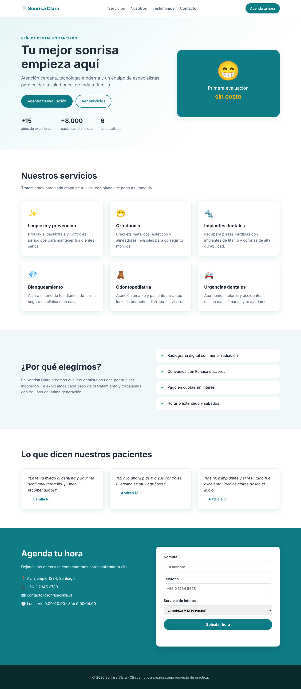

# Primer-Proyecto
es para crear el landing de una pagina web con claude

## Landing: Sonrisa Clara (clínica dental ficticia)

Página estática en HTML + CSS, sin dependencias ni paso de compilación.

Para verla, abre `index.html` en el navegador (doble clic) o sirve la carpeta:

```bash
python3 -m http.server 8000
# luego abre http://localhost:8000
```


